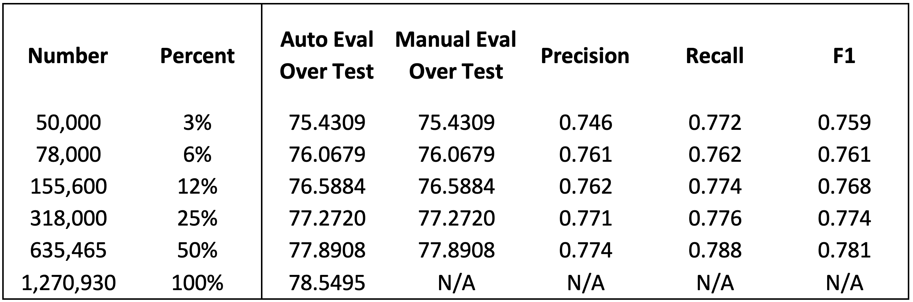

# NLP-Twitter-Sentiment-Analysis-Project
| Developer Name | VCU Email Address | Github Username |
| :---: | :---: | :---: |
| Charles Cutler | cutlerci@vcu.edu | cutlerci |
| Christopher Smith | samsoncr@vcu.edu | samsoncr |

# WHEN WE ARE READY TO MAKE A TABLE OF CONTENTS
http://ecotrust-canada.github.io/markdown-toc/

## READ ME SHOULD CONTAIN THE FOLLOWING

* Project description

The objective of this project is to perform sentiment analysis on tweets from Twitter. Sentiment analysis is a classification problem in which our code will be able to predict the sentiment of a tweet given the text of the tweet. Sentiment is an attribute of a tweet that ranges from highly positive to highly negative; however, for the purpose of this project, sentiment is divided into two classes: positive or negative. Therefore, given any tweet, our code will label it as either positive or negative. Then we must analyze the accuracy of our model. We do this by comparing the model’s predictions to labels made by humans which are assumed to be correct.
The model for predicting sentiment is a convolutional neural network (CNN). This is a type of machine learning algorithm. It requires two steps. First, we must preprocess a large training dataset. The data used for this project can be found in the data folder with more description in the README.md in the data folder.
The dataset contains tweets and information about the tweets including their man-made labels. The tweets must be preprocessed before being vectorized and embedded. After its transformation, the data can then be given to the CNN which will learn from data how to predict sentiment.
We then collect the predictions of our model on a test set of data, and for our results we calculate the precision, recall, F1, and accuracy scores of our predictions. Further detail is found in the sections below.

* Installation instructions
  * Explicitly show how to install your code in point-by-point fashion
  * I will copy and paste the instructions onto the command line for installation
  * If you are using a jupyter notebook, please do not state “open jupyter notebook” – explain to a novice how to do this 
* Usage instructions
  * How do I run your code – Keep in mind I am used to running my programs on the command line and I don’t use an IDE – so how do I run your code? 

* Method 
  * What method did you use?
  * What feature representation(s) did you explore?
  * What algorithm(s) did you use?
  * A picture is worth a 1000 words
* Data
  * What is your data? - DONE
  * How many labels do you have? - DONE
  * What is your train/dev/test split? - DONE
  * How many instances in your train/dev/test split? - DONE
  * You can graph it. - DONE
* Results
  * What are the precision, recall, F1 and accuracy scores of your models? 
  * You can put those in a graph or table
* Discussion 
  * Analysis of your results
  * What worked?
  * What didn’t work?
  * Why? 
* Future Work 
  * What would you do next given all the time and resources in the world? 

# Data 
## Original Data
We used the Sentiment140 dataset that can be found online at: [Sentiment140](https://www.kaggle.com/datasets/kazanova/sentiment140?resource=download)
This dataset contains tweets annotated for sentiment analysis. They use two labels, specifically a 0 label for negative tweets and a 4 label for positive tweets. There are the exact same number of positive tweets as negative tweets making this a balanced dataset. This dataset consists of six pieces of information stored for each collected tweet. In order from left to right the pieces are: 
1) Target: The polarity of the tweet ( 0 = negative, 4 = positive ) 
2) Ids: The id of the tweet ( ex: 2087 )
3) Date: The date of the tweet ( ex: Sat May 16 23:58:44 UTC 2009 )
4) Flag: The query (ex: lyx). If there is no query, then this value is NO_QUERY.
5) User: The user that tweeted ( ex: robotickilldozr )
6) Text: The text of the tweet ( ex: Lyx is cool )
This data can be found in the Data sub-directory as "sentiment140Dataset.zip"

## Cleaned Data
After using the "preproccessor.py" python script that we wrote we obtained a cleaner version of the Sentiment140 dataset. Specifically we did the following preproccesing tasks to clean the data into the format we wanted for training our model:
1) Extract only columns 1, 2, and 6 from the original dataset and discard the rest of the columns. That is we only keep the ID, annotated sentiment, and text of the tweet.
2) Remove URLs from a tweet
3) Remove Mentions from a tweet
4) Contraction Expansion
5) Remove Numbers from a tweet
6) Remove Symbols from a tweet
7) Reduce any repeated more than twice chracters into just three ``ex: Loooooooooveeeeee becomes loooveee``
8) Remove StopWords from a tweet 
9) Lemmatize the words in a Tweet

This clean version of the dataset can be found in the Data sub-directory as "Cleaned_Sentiment140_Data.csv"

We split the data set into three pieces for use in training and evaluation of the model. We use an 80% train, 10% development or validation, and 10% test split. Numerically that break down looks as follows:

# Results
The following table displays results we obtained when training the model with the entire training data subset.

We were interested in how much data we actually need to train a model to do well. To investigate this we conducted an ablation study, using smaller and smaller subsets of the training data to train a model. The following sections describe the results we found. 
## Confusion Matrix

## Training Versus Validation Loss

## Precision, Recall, and F1 Performance Measures

